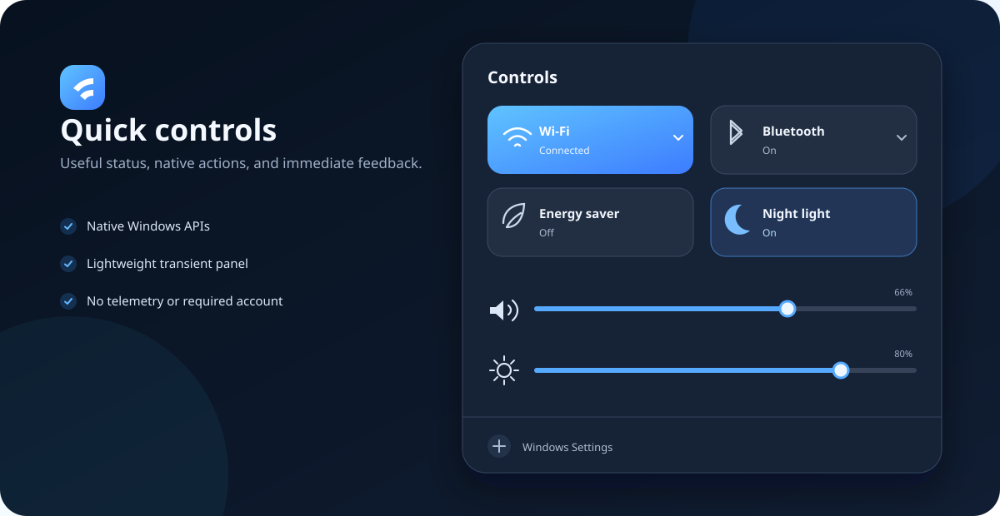

<div align="center">
  
  <h1>Orla</h1>
  <p><strong>A lightweight, native-first edge for Windows.</strong></p>
  <p>Multi-monitor top bars, quick controls, and optional Fluent Search integration in one small process.</p>

  [](https://github.com/Andradev/orla-windows/actions/workflows/build.yml)
  [](https://github.com/Andradev/orla-windows/releases)
  [](LICENSE)
  

  [Download](https://github.com/Andradev/orla-windows/releases/latest) · [Install](#installation) · [Documentation](#documentation)
</div>


## Native where reliability matters

Orla 2 uses the real Windows taskbar by default. Explorer remains responsible for launching, grouping, focusing, minimizing, previews, jump lists, badges, notifications, and taskbar recovery. Orla adds its top bar and quick controls without replacing those mature shell behaviors.

This design deliberately avoids patching `explorer.exe`, injecting code, editing opaque shell data, or manipulating undocumented taskbar internals. The result is less custom at the bottom edge, but substantially more predictable across Windows updates, first sign-in, multi-monitor changes, and applications such as Teams or other WebView-based software.

| Mode | Behavior | Support level |
|---|---|---|
| `Native` | Windows taskbar with native auto-hide; Orla provides the top bar and controls | **Default and recommended** |
| `OrlaDock` | Original floating visual dock and custom window switching | Legacy, optional |

Right-click an Orla surface to switch modes. The change is applied immediately and saved for the next sign-in.

## Features

- one reserved top bar per connected display;
- the native Windows taskbar and all of its standard interactions by default;
- system-managed taskbar auto-hide, with the user's previous state restored on exit or uninstall;
- compact quick controls for Wi-Fi, Bluetooth, Energy saver, Night light, volume, and brightness;
- native status for Wi-Fi strength, active connection, volume, mute, battery, and charging;
- integrated-display brightness through WMI and external monitor brightness through DDC/CI when supported;
- display language selected from Windows, with Portuguese, English, and Spanish included;
- date order, month names, separators, and 12/24-hour clock selected independently from the Windows regional format;
- optional Fluent Search integration: tapping `Win` alone toggles search on the display in use;
- `Win+Shift+S`, `Win+E`, `Win+D`, and other Windows shortcuts remain native;
- explicit recovery through `Orla.exe --restore`;
- no WebView, background service, driver, account, telemetry, or administrator requirement.



## Installation

### One-file installation

1. Download `Orla.exe` from the [latest release](https://github.com/Andradev/orla-windows/releases/latest).
2. Double-click it.
3. Confirm **Install Orla**.

The same executable copies itself to `%LOCALAPPDATA%\Orla\Orla.exe`, registers startup for the current user, adds an entry to **Settings → Apps → Installed apps**, and launches the installed copy. It does not request elevation.

Running a newer downloaded copy offers an in-place update. Running the same version simply opens the installed copy.

### Install from source

```powershell
git clone https://github.com/Andradev/orla-windows.git
cd orla-windows
powershell -NoProfile -ExecutionPolicy Bypass -File .\Install.ps1
```

Useful command-line options:

```powershell
Orla.exe --install --silent
Orla.exe --portable
Orla.exe --restore
Orla.exe --uninstall
Orla.exe --uninstall --silent --keep-settings
```

`--portable` is intended for development and bypasses installation redirection.

## Configuration

On first start, Orla creates `%LOCALAPPDATA%\Orla\settings.ini`:

```ini
FluentSearchPath=C:\Program Files\Fluent Search\FluentSearch.exe
BareWindowsKeyOpensFluent=true
TaskbarMode=Native
NativeTaskbarAutoHide=true
TopBarHeight=29
DockReservedHeight=61
```

- `TaskbarMode=Native` keeps all taskbar behavior inside Explorer.
- `TaskbarMode=OrlaDock` enables the original custom dock.
- `NativeTaskbarAutoHide=false` leaves the Windows taskbar continuously visible while Orla is running.
- `BareWindowsKeyOpensFluent=false` keeps the Start menu on a standalone Windows-key press.

Exit Orla before editing the file manually.

## Uninstallation and recovery

Use **Settings → Apps → Installed apps → Orla → Uninstall**, or run:

```powershell
%LOCALAPPDATA%\Orla\Orla.exe --uninstall
```

To keep the local configuration and log:

```powershell
.\Uninstall.ps1 -KeepSettings
```

Emergency taskbar recovery does not start the interface:

```powershell
%LOCALAPPDATA%\Orla\Orla.exe --restore
```

## Performance

Orla remains a single WPF/.NET Framework process. Native mode does not create dock windows, enumerate application groups for display, or run dock animations, so it removes the most failure-prone and frequently refreshed part of the previous architecture.

The historical ten-minute custom-dock measurement on the original development computer averaged 0.458% CPU and 78.08 MiB working set across two displays. Measurements vary by GPU, DPI, display count, and open applications; see [testing](docs/TESTING.md) before publishing comparisons.


## Architecture


Orla is an x64 WPF/.NET Framework executable with no runtime packages. It combines documented AppBar messages, Windows events, Core Audio, WLAN, Bluetooth radio APIs, WMI, DDC/CI, vector icons, and an optional low-level keyboard hook limited to a standalone Windows-key press.

The Windows taskbar API exposes taskbar buttons and auto-hide state, but not a supported way to replace the Windows 11 taskbar's internal visual tree or turn it into an arbitrary floating shape. Orla therefore treats Explorer as the owner of taskbar behavior and confines its design system to Orla-owned surfaces.

## Build and verification

```powershell
.\Build.ps1
.\tools\Verify-Repository.ps1
```

The build creates `dist\Orla.exe`. Release binaries are intentionally unsigned; compare the download with `Orla.exe.sha256` from the same release:

```powershell
(Get-FileHash .\Orla.exe -Algorithm SHA256).Hash
Get-Content .\Orla.exe.sha256
```

## Limitations

- Windows 11 does not provide a supported API for applying an arbitrary floating design to its native taskbar.
- The legacy `OrlaDock` mode cannot reproduce every private Explorer behavior and is retained mainly for existing users.
- Orla reports the active Wi-Fi connection but delegates network and device selection to Windows Settings.
- Some monitors block DDC/CI in Eye Saver, dynamic contrast, or power-saving picture modes.
- Elevated windows can reject activation requests from a non-elevated process.
- Fluent Search is a separate project and is not installed automatically.

## Security and privacy

Orla works locally and makes no network connection of its own. The installer writes only to the current user's profile and registry hive. See [Privacy](docs/PRIVACY.md) and [Security](SECURITY.md) for the complete model and private vulnerability reporting instructions.

## Documentation

- [Architecture](docs/ARCHITECTURE.md)
- [Testing and release criteria](docs/TESTING.md)
- [Troubleshooting](docs/TROUBLESHOOTING.md)
- [Privacy](docs/PRIVACY.md)
- [Changelog](CHANGELOG.md)
- [Support](SUPPORT.md)
- [Contributing](CONTRIBUTING.md)
- [Code of Conduct](CODE_OF_CONDUCT.md)
- [Security](SECURITY.md)
- [MIT License](LICENSE)
- [Third-party notices](THIRD_PARTY_NOTICES.md)

Orla is independent and is not affiliated with Apple, Microsoft, Seelen UI, or Fluent Search.
