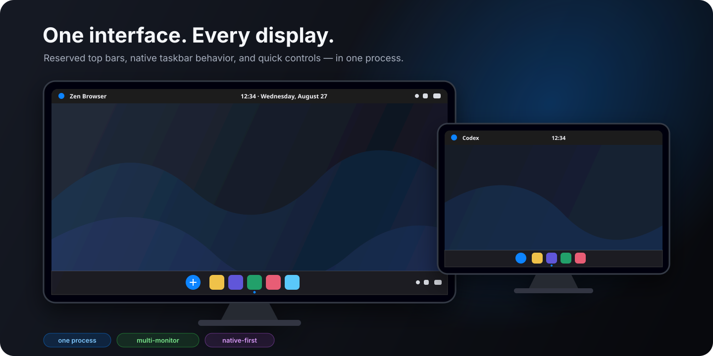
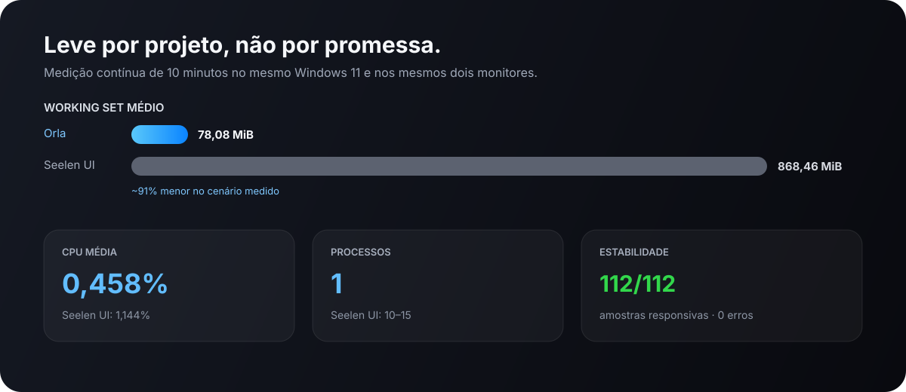
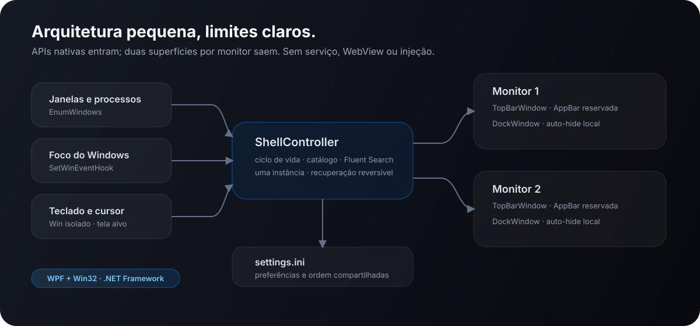

<div align="center">
  
  <h1>Orla</h1>
  <p><strong>Uma borda leve e elegante para o Windows.</strong></p>
  <p>Topbar e dock multi-monitor, sem WebView, widgets residentes ou modificação de arquivos do sistema.</p>

  [](https://github.com/Andradev/orla-windows/actions/workflows/build.yml)
  [](https://github.com/Andradev/orla-windows/releases)
  [](LICENSE)
  
</div>



## Por que Orla?

Orla substitui somente a experiência visual das bordas do desktop: uma topbar discreta e um dock flutuante. O Explorer continua sendo o shell do Windows, os atalhos `Win+...` permanecem nativos e nenhuma política corporativa é alterada.

O projeto nasceu de uma meta simples: manter a fluidez visual de um dock moderno usando um único processo pequeno, auditável e reversível.

## Recursos

- uma topbar e um dock independentes em cada monitor;
- identidade visual própria incorporada ao executável, derivada do símbolo oficial do projeto;
- topbar registrada como AppBar, reservando espaço para não cobrir janelas maximizadas;
- dock com ocultação automática e revelação imediata em toda a borda inferior, iniciada na primeira detecção de até 100 ms;
- aplicativos abertos aparecem nos dois docks e janelas do mesmo app são agrupadas;
- clique no app ativo minimiza imediatamente e devolve o foco ao aplicativo anterior; a decisão considera processo, janelas auxiliares e estado minimizado, inclusive quando Teams/WebView troca o HWND ou deixa uma janela minimizada registrada como foreground;
- resposta do dock em duas direções: uma elevação curta confirma abertura/ativação e um recuo confirma minimização; somente o conteúdo se move, preservando a área clicável inteira, e as animações respeitam a preferência de movimento do Windows;
- indicador de foco atualizado imediatamente por evento nativo do Windows;
- ordem dos aplicativos por arrastar e soltar, sem transformar apps fechados em fixos;
- nenhum aplicativo fica fixado por padrão; favoritos são adicionados explicitamente pelo menu de contexto;
- Lixeira ao fim do dock com o ícone oficial do Windows, atualizado automaticamente entre vazia e cheia;
- menu de contexto para janelas, nova instância, fixar, desafixar e fechar;
- Fluent Search opcional: `Win` isolado alterna abrir/ocultar pelo canal local da própria instância, aceita toques rápidos em ordem e posiciona no monitor em uso sem salto visível;
- botões do Fluent Search em cada tela sempre abrem a busca naquela tela;
- `Win+Shift+S`, `Win+E`, `Win+D` e outras combinações continuam no Windows;
- indicadores oficiais Microsoft Fluent UI de Wi-Fi, volume e bateria, sincronizados nas duas telas e reunidos em uma única área interativa;
- chevron da topbar abre e fecha os ícones ocultos nativos, acompanha o estado com animação e só revela o flyout depois de posicionado no topo;
- hover dos controles mantém ícones e textos imóveis e realça apenas a superfície arredondada ao fundo;
- intensidade do Wi-Fi e nome do perfil conectado por API nativa, com fallback automático para somente o sinal quando a privacidade ou política do Windows restringe o nome;
- painel rápido em português, inglês ou espanhol conforme o idioma de exibição do Windows;
- data, ordem dos campos e relógio de 12/24 horas seguem separadamente o formato regional configurado no Windows;
- painel compacto em grade com Wi-Fi, Bluetooth, Economia de energia e Luz noturna; estados ligados usam a mesma superfície azul do Windows;
- volume e brilho ficam em duas linhas independentes, somente com ícone e slider; o ícone de volume alterna mute e o hover do ícone ou slider mostra a porcentagem atual;
- um único slider de brilho controla o computador; a tela integrada usa WMI e monitores externos compatíveis usam DDC/CI;
- detecção do brilho executada em segundo plano, sem atrasar a abertura do painel;
- Wi-Fi e Bluetooth usam cartões divididos no padrão do Windows: o corpo alterna o rádio pela API oficial e o chevron abre a configuração específica;
- Economia de energia e Luz noturna mostram o estado atual e encaminham para as páginas oficiais do Windows, sem escrever em chaves internas do sistema;
- ícones vetoriais de 20 px consistentes para sinal, volume e níveis de bateria; o próprio ícone de som no painel também alterna mute;
- Bluetooth permanece exclusivamente no painel, inclusive quando desligado, sem ocupar espaço na topbar;
- restauração explícita da barra nativa ao sair, desinstalar ou usar `--restore`.


## Desempenho medido

Teste contínuo de 10 minutos em Windows 11, Intel Iris Xe e dois monitores:

| Medida | Orla | Seelen UI no mesmo PC |
|---|---:|---:|
| CPU média | **0,458%** | 1,144% |
| Working set médio | **78,08 MiB** | 868,46 MiB |
| Working set máximo | **80,05 MiB** | 1.221,24 MiB |
| Memória privada média | **64,60 MiB** | 389,65 MiB |
| Processos | **1** | 10–15 |
| Erros/avisos durante o teste | **0** | 8 |



Os resultados variam conforme GPU, escala de DPI, quantidade de monitores e aplicativos abertos. Os números acima são evidência de uma máquina real, não uma garantia universal.

Como regressão da versão 1.2.0, uma execução limpa de 60 segundos no mesmo PC e com dois monitores mediu 0,746% de CPU média, 74,37 MiB de working set e 63,59 MiB privados. Mesmo com indicadores reais e callbacks de áudio, a média permaneceu abaixo de 1% de CPU e a memória caiu aproximadamente 9–10% em relação à medição curta da versão 1.1.6.

## Instalação

Requisitos: Windows 10/11 x64, PowerShell 5.1+ e .NET Framework 4.8. Fluent Search é opcional.

```powershell
git clone https://github.com/Andradev/orla-windows.git
cd orla-windows
powershell -NoProfile -ExecutionPolicy Bypass -File .\Install.ps1
```

O instalador compila o código localmente, instala em `%LOCALAPPDATA%\Orla` e cria somente a entrada de inicialização do usuário. No login, a Orla lê o mesmo `settings.ini`, recria as barras em todos os monitores e restaura a integração com o Fluent Search. Não solicita privilégios de administrador.

Se o Windows tentar restaurar uma cópia baixada ou usada em testes, ela transfere a inicialização para `%LOCALAPPDATA%\Orla\Orla.exe`. Isso impede uma cópia temporária de assumir a instância única antes da instalação oficial. Desenvolvedores que precisem executar intencionalmente outro binário podem usar `Orla.exe --portable`.

Para não iniciar automaticamente no login:

```powershell
.\Install.ps1 -NoStartup
```

Instalações antigas do VictorShell são migradas automaticamente: configurações são preservadas e a entrada antiga de inicialização é removida.

## Uso

| Ação | Resultado |
|---|---|
| Clique | Ativa; se já estiver ativo, minimiza |
| Clique do meio | Abre uma nova janela/instância |
| Arrastar | Reorganiza o aplicativo nos dois docks |
| Botão direito | Mostra ações e janelas do grupo |
| Lixeira | Abre a Lixeira do Windows e acompanha o estado vazia/cheia |
| Borda inferior | Revela o dock daquele monitor |
| `Win` isolado | Abre o Fluent Search no monitor do cursor |
| Botão de busca | Abre o Fluent Search no monitor do botão |
| Conjunto de estados na topbar | Alterna o painel rápido naquela tela; clicar fora ou pressionar `Esc` também fecha |
| Chevron de ícones ocultos | Alterna o flyout nativo da bandeja e anima a direção do indicador |
| Controle de brilho | Ajusta a tela integrada e monitores externos DDC/CI detectados |
| Corpo do cartão Wi-Fi ou Bluetooth | Ativa/desativa o rádio pela API do Windows |
| Chevron de Wi-Fi/Bluetooth | Abre a configuração específica do Windows |
| Economia de energia ou Luz noturna | Abre a página oficial correspondente nas Configurações |

## Configuração

Na primeira execução, Orla cria `%LOCALAPPDATA%\Orla\settings.ini`:

```ini
FluentSearchPath=C:\Program Files\Fluent Search\FluentSearch.exe
BareWindowsKeyOpensFluent=true
TopBarHeight=29
DockReservedHeight=61
PinnedApp=
```

Feche o Orla antes de editar. Use `BareWindowsKeyOpensFluent=false` para manter o menu Iniciar na tecla Windows. Linhas `AppOrder=` guardam somente a ordem; aplicativos fechados continuam desaparecendo.

## Desinstalação e recuperação

```powershell
powershell -NoProfile -ExecutionPolicy Bypass -File .\Uninstall.ps1
```

Para preservar configuração e log:

```powershell
.\Uninstall.ps1 -KeepSettings
```

Recuperação direta da barra nativa:

```powershell
%LOCALAPPDATA%\Orla\Orla.exe --restore
```

## Arquitetura



Orla é um executável WPF/.NET Framework x64 sem pacotes externos em tempo de execução. Ele combina AppBar, enumeração de janelas, `SetWinEventHook` para foco, APIs nativas de áudio/WLAN/Bluetooth/DDC-CI, `Windows.Devices.Radios` para os toggles, WMI para o painel integrado, ícones vetoriais incorporados e um hook de teclado limitado ao `Win` isolado. Veja [Arquitetura](docs/ARCHITECTURE.md) e [Solução de problemas](docs/TROUBLESHOOTING.md).

## Build

```powershell
.\Build.ps1
```

O resultado fica em `dist\Orla.exe`. O binário da release é intencionalmente não assinado; confira o SHA-256 publicado ou compile localmente.

O ícone do executável é gerado a partir de `docs\images\orla-mark.svg`. Para reconstruir `assets\orla.ico` após alterar o símbolo, execute `powershell -NoProfile -ExecutionPolicy Bypass -File .\tools\GenerateIcon.ps1`.

## Limitações

- o painel informa a conexão ativa, mas não lista redes nem dispositivos; essas ações são encaminhadas às páginas oficiais do Windows;
- o Windows não publica uma API segura para alternar Luz noturna ou Economia de energia sob demanda; Orla abre as páginas oficiais e não modifica o armazenamento interno `CloudStore`;
- alguns monitores bloqueiam comandos DDC/CI em modos de imagem como Eye Saver, economia de energia ou contraste dinâmico;
- janelas elevadas podem recusar ativação por um processo não elevado;
- Fluent Search é um projeto separado e não é instalado automaticamente;
- a identidade visual é inspirada em princípios gerais de clareza, hierarquia e movimento, sem afiliação com fabricantes de sistemas operacionais.

## Projeto

- [Contribuindo](CONTRIBUTING.md)
- [Segurança](SECURITY.md)
- [Licença MIT](LICENSE)
- [Avisos de terceiros](THIRD_PARTY_NOTICES.md)
- [Releases](https://github.com/Andradev/orla-windows/releases)

Orla é independente e não é afiliado à Apple, Microsoft, Seelen UI ou Fluent Search.
